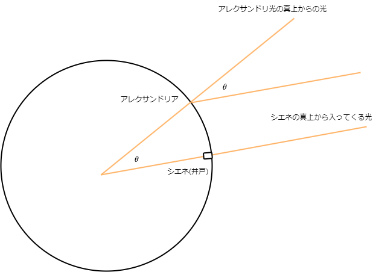

# 第一回：「個体地球」

---

# 地球の形と大きさ

地球はほぼ球形ですが、赤道付近がやや膨らんでいる**回転楕円体**です。特に地球の形の回転楕円体を**地球楕円体**と呼びます。

- 赤道半径(a)：6378.137 km
- 極半径(b)：6356.852 km
- **扁平率(へんぺいりつ)：$\frac{a-b}{b} = \frac{1}{298.26}$** 

- エラトステネスの方法

---

# 地球の表面(ジオイド)

ジオイドは、実際の地形の凹凸を無視して仮想的に一続きの海で覆った時の平均海水面を考えてこの理想的な面を**ジオイド**といいます。

---

# 地球の内部構造

地球の内部は、**地殻**、**マントル**、**外核**、**内核**の4つの主要な層に分かれています。地殻は最も外側の層で、マントルはその下に位置し、外核と内核は地球の中心にあります。
また、地震波で内部構造を考えたときに観測できない場所がありこれを**シャードーゾーン**といいます。

- 地殻は大陸地殻と海洋地殻に分かれています。
- マントルは個体ですが流動性があります。かんらん岩質岩石で構成されています。
- 外核は液体の鉄とニッケルで構成されています。
- 内殻は固体の鉄とニッケルで構成されています。
  
---

# 地殻の構造とアイソスタシー

地殻は大陸地殻と海洋地殻に分かれています。大陸地殻の上層部は**花こう岩質**、下層部は**玄武岩質**で構成されています。海洋地殻は**玄武岩質**で構成されています。

地殻とマントルの境界面を**モホロビッチ不連続面**(**モホ面**)といいます。

氷が水が浮くように地殻がマントルに浮かんでいることを**アイソスタシー**といいます。

---

# 大陸移動説と海洋底拡大説

大陸移動説は、かつて一つの巨大な大陸(パンゲア大陸)が存在し、それが分裂して現在の大陸が形成されたという理論です。

海洋底拡大説は、海洋底が新しい地殻(海嶺)の生成によって広がっていることを説明します。

理由:

- **枕状溶岩**の形成：海底火山の噴火によって海底が広がる
- 震源が浅い地震が見られる
- 海嶺付近の地殻が若い

---

# プレートテクトニクス

プレートテクトニクスは、海底底拡大から地球表面に複数枚のプレートが存在し、それらが移動しているという理論です。

地殻の物理学区分(粘性)

- **リソスフェア**：地球の表面に存在する固体の地殻と上部マントルの上部
- **アセノスフェア**: 上部マントルの下部

プレート

- 海洋プレート：海洋地殻とマントル上部
- 大陸プレート：大陸地殻とマントル上部

---

# プレート境界

- **発散境界**：プレートが離れる境界,**海嶺で見られる**,海の周辺に位置
- **収束境界**：プレートが接する境界,**山脈や海溝で見られる**,**大陸緑辺に多い**
- **すれ違い境界**：プレートが平行にすれ違う境界
  - **トランスフォーム断層**：プレートが平行にすれ違う境界の断層
  - **サンアンドレアス断層**：アメリカ西海岸に位置するトランスフォーム断層

造山運動(収束境界で発生)
- 沈み込みによる火山活動では**島弧**が形成されます。(例：日本列島)
- 大陸どおしが衝突すると山脈が形成されます。(例：ヒマラヤ山脈)

---

# 地震

地震は、地殻内の断層のずれによって発生する振動です。

- **震源**：地震が発生した場所
- **震央**：地震を感じる地表の位置
  
地震の規模の指標

- **震度**：地震の揺れの強さ
    - 震度階級：震度の揺れの強さ(10段階)を示す指標(1,2,3,4,5弱,5強,6弱,6強,7)
- **マグニチュード**：地震のエネルギーの大きさ
  - $M = \log_{10}{a}$ マグニチュード$a$で示されます

---

# 日本列島のテクトニクス

日本列島は、複数のプレートが交わる場所に位置しており、地震や火山活動が活発です。

プレートの沈み込みに伴って海溝から200kmほど陸側に島弧が形成されています。これを**島弧-海溝系**といいます。

- ユーラシアプレート: 大陸プレート、南側
- 北米プレート: 大陸プレート、北側
- 太平洋プレート: 海洋プレート、北側
- フィリピン海プレート: 海洋プレート、南側

---

# 日本の地質構造(構造線)

日本には多くの構造線が存在し、これらは地殻変動の結果として形成されました。代表的な構造線には、**糸魚川-静岡構造線**や中央構造線があります。

二重の深発地震帯を**和達-ベニオフ帯**といいます

---

# 火山の分布

火山は、プレート境界やホットスポットに沿って分布しています。

- 海溝側の火山が分布するラインを**火山前線**(火山フロント)と言います。
- **ホットスポット**プレート境界にない火山、プレート運動とともに島を形成する (ex:**天皇海山列**)

---

# マグマ

マグマは、地球内部の高温で溶けた岩石です。マグマが地表に噴出すると、溶岩となります。地下深くのマグマがたまっているところをマグマ溜まりといいます。

- マグマ:地中
- 溶岩:地表

---

# 火山活動と火山

火山の噴火は地下深くで**水蒸気爆発**が起こり、急激に体積が膨張することで起きます。

火山噴出物

- **火山ガス**:火山の噴火によって噴出される気体、ほとんどが水蒸気(90%)
- **溶岩**:地表に噴出したマグマ、冷え固まって火成岩になります
- 火山噴出物:火山の噴火によって噴出される固体の物質
  - **火山灰**:火山の噴火によって噴出される微細な粒子
  - **火山れき**:火山の噴火によって噴出される固体(中間の大きさ)
  - **火山弾**:火山の噴火によって噴出される固体の塊
  - **スコリア**:玄武岩質の噴出物に含まれる黒色多孔質の岩石

---

# 火山の種類

- **盾状火山**:流動性が強い、黒色、回数が多く小規模(ex:マウナロア、ハワイ)
- **成層火山**:中間的(ex:富士山)
- **鐘状火山**:流動性が低い、白色、回数が少なく大規模噴火(ex:昭和新山)

